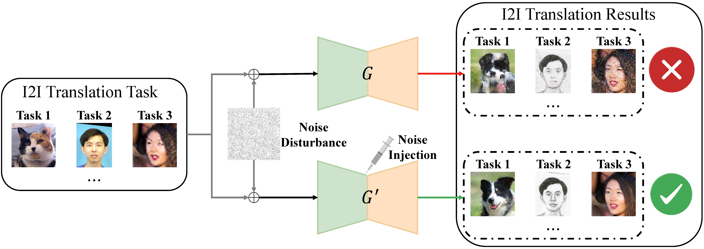

# Noise Injection - Official PyTorch Implementation



This repository provides the discription for the following paper:

**On the Analysis of GAN-based Image-to-Image Translation using Gaussian Noise Injection**<br>
Chaohua Shi, Kexin Huang, [Lu Gan](https://scholar.google.com/citations?hl=zh-CN&user=zFHPoMYAAAAJ&view_op=list_works&sortby=pubdate), [Hongqing Liu](https://scholar.google.com/citations?hl=zh-CN&user=04nXyUQAAAAJ&view_op=list_works&sortby=pubdate), [Mingrui Zhu](https://scholar.google.com/citations?user=a8FXS1UAAAAJ&hl=zh-CN&oi=ao), [Nannan Wang](https://scholar.google.com/citations?hl=zh-CN&user=SRBn7oUAAAAJ) and [Xinbo Gao](https://scholar.google.com/citations?user=VZVTOOIAAAAJ&hl=zh-CN&oi=ao)<br>
In ICLR 2024.<br>
[**Paper Page**](https://openreview.net/forum?id=sLregLuXpn) 
> **Abstract:** *Image-to-image (I2I) translation is vital in computer vision tasks like style transfer and domain adaptation. While recent advances in GAN have enabled high-quality sample generation, real-world challenges such as noise and distortion remain significant obstacles. Although Gaussian noise injection during training has been utilized, its theoretical underpinnings have been unclear. This work provides a robust theoretical framework elucidating the role of Gaussian noise injection in I2I translation models. We address critical questions on the influence of noise variance on distribution divergence, resilience to unseen noise types, and optimal noise intensity selection. Our contributions include connecting f-divergence and score matching, unveiling insights into the impact of Gaussian noise on aligning probability distributions, and demonstrating generalized robustness implications. We also explore choosing an optimal training noise level for consistent performance in noisy environments. Extensive experiments validate our theoretical findings, showing substantial improvements over various I2I baseline models in noisy settings. Our research rigorously grounds Gaussian noise injection for I2I translation, offering a sophisticated theoretical understanding beyond heuristic applications.*


**Dependencies:**

We have tested on:
- CUDA 10.1
- PyTorch 1.7.0
- Pillow 8.0.1; Matplotlib 3.3.3; opencv-python 4.4.0; Faiss 1.7.0; tqdm 4.54.0

All dependencies for defining the environment are provided in `environment/noise_injection_env.yaml`.
We recommend running this repository using [Anaconda](https://docs.anaconda.com/anaconda/install/):
```bash
conda env create -f ./environment/noise_injection_env.yaml
```

<br/>

## (1) Image-to-Image Translation Models for Experimentation

We have employed the Gaussian noise-injected training methodology in various image-to-image translation models and contrasted them with their original baselines. Specifically,
- [HiFaceGAN](https://github.com/Lotayou/Face-Renovation), a GAN-based I2I model primarily utilized for Face Super-Resolution task on real-life facial photographs, was tested with the FFHQ dataset
- [GP-UNIT](https://github.com/williamyang1991/GP-UNIT), a generative prior-based image translation model for converting images between unpaired data domains, was subjected to the Cat-to-Dog image translation task on the AFHQ dataset.
- Sketch Transformer, a Transformer-based image translation model, was evaluated on its ability to convert photo-sketch paired data from the CUFS dataset in the Photo-to-Sketch image translation task.

## (2) Datasets
- [FFHQ](https://github.com/NVlabs/ffhq-dataset) for HiFaceGAN. We selected the 10,000 images with the lowest serial number for training, while the final 1,000 images were used for testing. We perform a 16x face super-resolution task on this dataset, where the HR resolution is 512x, and the LR resolution is 32x.
- [AFHQ](https://github.com/clovaai/stargan-v2/tree/master) for GP-UNIT. It contains high-resolution images of animal faces, including cats, dogs, and wild animals, from three domains with substantial variations. Each domain comprises 500 test images. We perform the Cat-2-Dog image translation task on this dataset.
- [CUFS](https://mmlab.ie.cuhk.edu.hk/datasets.html) for Sketch Transformer. It contains 188 identities from the CUHK student database, 123 from the AR database, and 295 from the XM2VTS database We perform the Photo-2-Sketch image translation task on this dataset.
